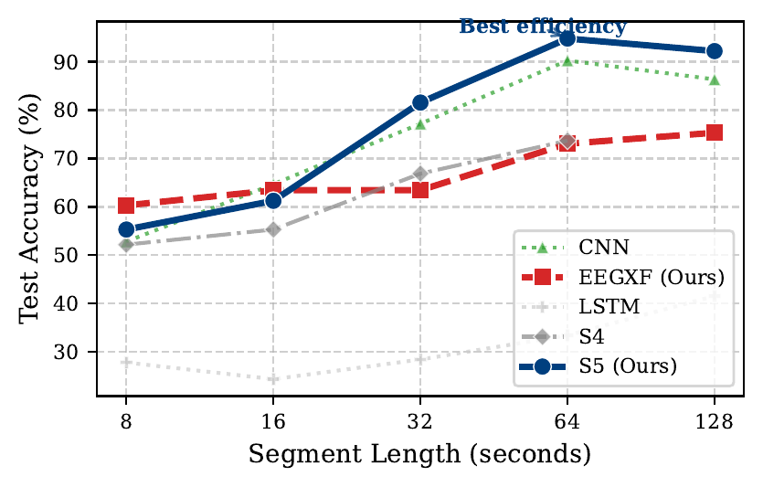
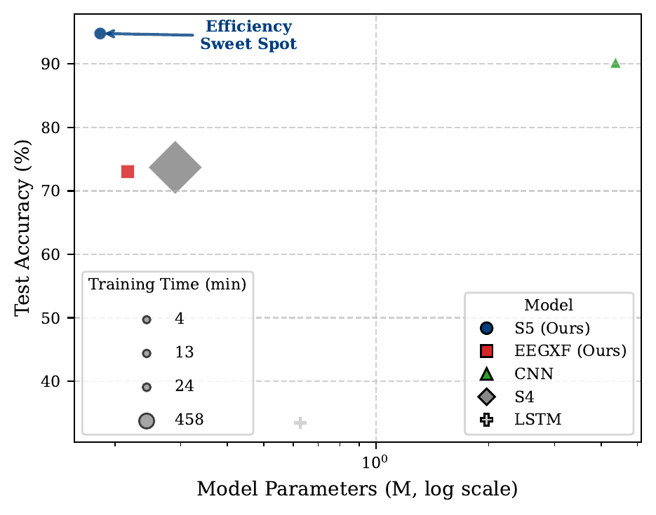
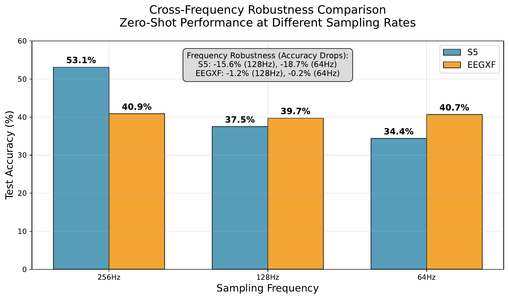

# EEG S5 Benchmark

**Temporal Context and Architecture: A Benchmark for Naturalistic EEG Decoding**
*Mehmet Ergezer, Wentworth Institute of Technology, ICASSP 2026*

## Overview

This repository contains the code, results, and paper for a systematic benchmark comparing five neural architectures for naturalistic EEG decoding using the HBN movie-watching dataset:

| Model | Description |
|-------|-------------|
| CNN | Local convolutional baseline |
| LSTM | Recurrent baseline |
| EEGXF | Stabilized EEG Transformer (introduced here) |
| S4 | Structured State Space model |
| **S5** | Simplified S4 — best parameter efficiency |

Models are evaluated across segment lengths from **8 s to 128 s** on a 4-class movie classification task, plus three generalization tests: zero-shot cross-task, cross-frequency, and leave-one-subject-out (LOSO).

### Key Result
At 64 s, **S5 reaches 98.7% ± 0.6** accuracy using ~20× fewer parameters than CNN. EEGXF offers greater robustness under distribution shift.

## Repository Structure

```
eeg-s5-benchmark/
├── train.py                     # Main training script (all 5 architectures)
├── models/
│   ├── __init__.py              # Unified import: from models import S5Classifier
│   ├── cnn.py                   # CNNClassifier
│   ├── lstm.py                  # LSTMClassifier
│   ├── transformer.py           # TransformerClassifier (standard)
│   ├── eeg_transformer.py       # EEGXF — stabilized EEG Transformer (introduced here)
│   ├── s4.py                    # OptimizedS4Classifier
│   └── s5.py                    # S5Classifier
├── ablation/
│   └── run_ablation.py          # Multi-GPU ablation study (3 seeds)
├── analysis/
│   ├── generate_figures.py      # Paper figures (Fig 1–3)
│   ├── create_efficiency_plots.py
│   ├── analyze_results.py
│   ├── analyze_publication_results.py
│   └── statistical_significance_analysis.py
├── figures/                     # Paper figures (PNG + PDF)
└── results/                     # Experiment result JSONs
```

## Usage

### Training

```bash
python train.py --model s5 --segment_length 64 --dataset hbn
```

See `train.py` for the full list of arguments (model, segment length, dataset path, GPU settings).

### Running the Ablation Study

```bash
python ablation/run_ablation.py
```

Runs all model × segment-length combinations across 3 seeds on available GPUs.

### Generating Paper Figures

```bash
python analysis/generate_figures.py --results_dir results/
```

## Results

### Fig. 1 — Accuracy vs. Segment Length



S5 and CNN demonstrate the strongest performance scaling with temporal context. The x-axis is log-scaled.

### Table 1 — Main Results (4-class Subject-Mixed Classification)

32/64/128 s results are mean ± std over 3 seeds; 8/16 s are single-seed.

| Model | Seg (s) | Acc. (%) | F1 | Time (min) | Params |
|-------|---------|----------|----|------------|--------|
| **S5** | 8 | 55.3 | 0.553 | 3.9 | **183K** |
| | 16 | 61.3 | 0.614 | 5.1 | **183K** |
| | 32 | 94.4 ± 0.7 | 0.930 ± 0.013 | 19.9 ± 2.2 | **183K** |
| | **64** | **98.7 ± 0.6** | **0.978 ± 0.011** | 25.8 ± 6.2 | **183K** |
| | 128 | 95.8 ± 0.6 | 0.929 ± 0.007 | 17.8 ± 4.8 | **183K** |
| **EEGXF** | 8 | 60.3 | 0.605 | 16.2 | 217K |
| | 16 | 63.4 | 0.635 | 22.9 | 217K |
| | 32 | 80.1 ± 2.0 | 0.748 ± 0.029 | 35.8 ± 0.3 | 217K |
| | 64 | 84.2 ± 0.6 | 0.749 ± 0.010 | 11.6 ± 0.1 | 217K |
| | 128 | 76.7 ± 1.5 | 0.526 ± 0.032 | 6.3 ± 2.6 | 217K |
| **CNN** | 8 | 52.8 | 0.531 | **0.9** | 4.4M |
| | 16 | 64.7 | 0.650 | **1.2** | 4.4M |
| | 32 | 94.5 ± 0.3 | 0.931 ± 0.004 | **7.5 ± 0.02** | 4.4M |
| | 64 | 97.2 ± 0.9 | 0.953 ± 0.018 | **4.9 ± 0.6** | 4.4M |
| | 128 | 89.2 ± 1.5 | 0.684 ± 0.097 | **6.4 ± 0.06** | 4.4M |

### Table 2 — Inter-Movie Confusion at 64 s

| Model | Movie Confusion Rate (%) ↓ |
|-------|--------------------------|
| **S5** | **2.7%** |
| **CNN** | **2.7%** |
| EEGXF | 32.4% |

### Fig. 2 — Performance–Efficiency Tradeoff at 64 s



Accuracy vs. parameters (log-scale); marker size ∝ training time. S5 occupies the optimal top-left quadrant.

### Fig. 3 — Cross-Frequency Robustness (Zero-shot)



Models trained at 250 Hz, tested zero-shot at 128 Hz and 64 Hz. EEGXF exhibits superior robustness; S5 drops >18 pp.

### Table 3 — Leave-One-Subject-Out (LOSO) on 32 s Segments

| Model | Mean Acc. (%) | Std. Dev. | Folds | Time/Fold |
|-------|--------------|-----------|-------|-----------|
| **S5** | **55.9** | 15.9 | 60 | ~41 min |
| EEGXF | 48.4 | 12.1 | 20 | ~52 min |

S5 significantly outperformed EEGXF in accuracy (*p* < 0.01) and F1-score (*p* < 10⁻⁵).

### Table 4 — Zero-Shot Cross-Task Generalization & Calibration

| Model | Task Input | OOD Pred. | OOD Conf. | ECE (%) ↓ |
|-------|-----------|-----------|-----------|-----------|
| **S5** | Symbol Search | Movie 3 | 60.0% | **1.09 ± 0.12** |
| | Contrast Change | Movie 3 | 60.0% | |
| **EEGXF** | Symbol Search | Resting | **26.0%** | 13.41 ± 1.68 |
| | Contrast Change | Resting | **26.0%** | |

S5 makes overconfident errors on OOD tasks; EEGXF defaults to a conservative low-confidence "resting" prediction.

## Citation

```bibtex
@inproceedings{ergezer2026eegbenchmark,
  title     = {Temporal Context and Architecture: A Benchmark for Naturalistic {EEG} Decoding},
  author    = {Ergezer, Mehmet},
  booktitle = {Proc. IEEE Int. Conf. Acoustics, Speech and Signal Processing (ICASSP)},
  year      = {2026}
}
```

## License

MIT
